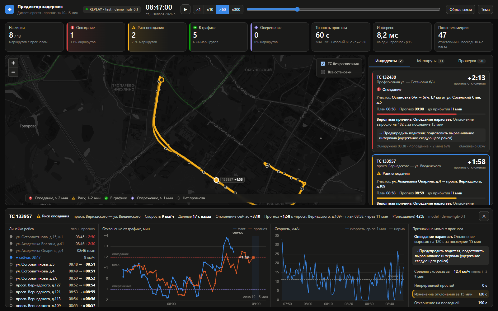

# Дашборд диспетчера · Предиктор задержек

Прототип BI-дашборда (критерий 4 ТЗ). На экране:
- карта маршрутной сети с положением ТС и цветом риска;
- лента инцидентов: прогноз опоздания, вероятная причина, рекомендация;
- карточка ТС с ниткой графика;
- проверка прогнозов по факту.

Данные обновляются в реальном времени.



Страница на HTML/JS без сборки. Всё своё и открытое, внешних запросов нет:
- **карта** — MapLibre GL;
- **подложка** — OpenStreetMap в локальном файле PMTiles, стиль Protomaps с русскими подписями;
- **графики** — ECharts.

Библиотеки, шрифты и иконки лежат в `vendor/`, поэтому дашборд работает в закрытом контуре без интернета и API-ключей.

| Режим | Откуда данные | Когда нужен |
|---|---|---|
| **REPLAY** | `data/replay.js` — день 06.01.2026 из датасета, воспроизводится в браузере | демо и питч без backend; резерв, если backend недоступен |
| **LIVE** | backend `/api/v1/*` по контракту [`CONTRACT.md`](CONTRACT.md), опрос раз в 2 с | работа системы: телеметрия → backend → прогноз → дашборд |

## Запуск одной командой

**Всё вместе в Docker** (backend + дашборд), из корня репозитория:

```bash
python dashboard/tools/build_fixtures.py --data-dir ../dataset   # сеть маршрутов и replay (~10 с)
python dashboard/tools/fetch_basemap.py                          # подложка карты, ~60 МБ (один раз)
DATA_DIR=../dataset docker compose up --build                    # http://localhost:8080
```

Если порт 8080 занят, задайте `DASHBOARD_PORT=18090`. В Git Bash на Windows сначала выполните `export MSYS_NO_PATHCONV=1`.

**Только дашборд, без Docker:**

```bash
python dashboard/serve.py --open                                           # REPLAY
python dashboard/serve.py --open --api http://127.0.0.1:8000/api/v1        # LIVE с backend
```

`serve.py` — небольшой сервер на стандартной библиотеке Python. Обычный `python -m http.server` не подходит: подложка читается из PMTiles кусками (HTTP Range), а он так не умеет. Если открыть `index.html` двойным кликом, всё работает, кроме подложки. Об этом скажет подсказка на карте.

## Режим LIVE: связка с backend

Backend (`backend/`) отдаёт `/api/v1/network`, `/schedule`, `/vehicles`, `/predictions`, `/incidents`, `/metrics`, `/config`. Пока нет живого NDTP-потока, backend сам воспроизводит исторический день из CSV.

Дашборд управляет этим воспроизведением из шапки:

| Кнопка | Эндпоинт backend |
|---|---|
| пауза и скорость | `POST /api/v1/demo/speed` |
| перемотка | `POST /api/v1/demo/start?t=ЧЧ:ММ` |
| «Обрыв связи» | `POST /api/v1/demo/link?down=true` |

Если backend недоступен при старте, дашборд переходит на `data/replay.js` и показывает баннер.

Для отладки без backend есть `tools/mock_backend.py`: те же ответы, собранные из `replay.js`.

## Откуда берутся данные

Генератор `tools/build_fixtures.py` собирает данные из датасета (`test`). Браузер на каждый момент показывает только то, что уже произошло.

| Что на экране | Источник |
|---|---|
| Положение, скорость, курс ТС | `traffic.csv` |
| Остановки, план | `schedule.csv` (план). Безымянным остановкам подписан ближайший адрес |
| Геометрия маршрутов | GPS-трек ТС между прибытиями на соседние остановки, выгружается в `data/network.json` (им пользуется и backend) |
| Прогноз | REPLAY — демо-модель sklearn или `--predictions`; LIVE — ML-сервис через backend, без него — fallback «прогноз = текущее отклонение» |
| Причины и рекомендации | Правила `backend/app/services/incident_rules.py` — одни и те же в REPLAY и в backend |
| Факт, «Проверка», живой MAE | `time_fact_begin` показывается только после наступления события. В backend факт служит только для сверки, в признаки не попадает |

Как подключить прогнозы модели в REPLAY:
1. `tools/build_fixtures.py` пишет точки `data/points_grid.csv` в формате `validate/points.csv`.
2. Модель отдаёт CSV в формате сабмита `sample_id;prediction[;late_probability]`.
3. Пересборка: `python dashboard/tools/build_fixtures.py --predictions preds.csv`.

Демо-модель на `labels_test` даёт MAE 67 с против 93 с у `cur_dev_s`. Цифра оптимистична: train и test — один день на тех же ТС. Эта модель нужна только для правдоподобного демо.

## Параметры адреса

| Параметр | Пример | Что делает |
|---|---|---|
| `api` | `?api=http://localhost:8000/api/v1` | режим LIVE |
| `replay` | `?replay=1` | принудительно REPLAY |
| `t`, `speed`, `paused` | `?t=18:30&speed=10&paused=1` | время старта, скорость, пауза (REPLAY) |
| `sel`, `tab` | `?sel=132430&tab=verified` | открыть карточку ТС, вкладку |
| `down` | `?down=3` | имитация обрыва связи 3 минуты назад (REPLAY) |

Клавиши: пробел — пауза, ← / → — ±5 мин, Esc — закрыть карточку.

## Сценарий демо для жюри (~2 мин)

1. **Экран за 5 секунд.** Плитки: сколько маршрутов опаздывает, под риском, в графике. Карта: маршруты окрашены по риску, толстая линия — проблемный участок до целевой остановки.
2. **Карточка инцидента.** В ней:
   - ТС и участок «откуда → куда»;
   - план и прогноз прибытия;
   - сколько осталось до события (горизонт 10–15 мин);
   - причина с цифрами и рекомендация.
3. **Клик по ТС.** Открываются:
   - линейка рейса;
   - график «факт против прогноза» с окном 10–15 мин;
   - скорость относительно нормы;
   - признаки, на которых основан вывод.
4. **Честность прогноза.** Вкладка «Проверка»: каждый прогноз сверяется с фактом, считается живой MAE против базового.
5. **Надёжность.** «Обрыв связи»: backend переходит в `ingest_status: down`, дашборд помечает данные устаревшими, сервис не падает. После «Восстановить связь» поток догружается.

## Устройство

```text
dashboard/
├── index.html, config.js     страница и режим по умолчанию (в Docker: DASHBOARD_API)
├── serve.py                  запуск без Docker (статика + HTTP Range)
├── css/style.css             тёмная и светлая темы
├── js/util.js                время (МСК), форматирование, уровни риска, сеть
├── js/map.js                 карта MapLibre: подложка PMTiles, маршруты, участки, маркеры ТС
├── js/source-replay.js       REPLAY: состояние на момент now только из данных ≤ now
├── js/source-api.js          LIVE: опрос backend, управление воспроизведением, деградация
├── js/app.js                 KPI, инциденты, маршруты, проверка, карточка ТС
├── data/replay.js            день для воспроизведения (генерируется)
├── data/network.json         справочник сети для backend (генерируется)
├── data/basemap/moscow.pmtiles   подложка OSM (tools/fetch_basemap.py, в git не хранится)
├── tools/build_fixtures.py   сборка данных, демо-модель, примеры контракта
├── tools/fetch_basemap.py    скачивание вырезки OSM (Protomaps) по району маршрутов
├── tools/mock_backend.py     эталонный backend по контракту для отладки
├── CONTRACT.md, contract/examples/   формат данных между ML, backend и дашбордом
└── Dockerfile, docker/       nginx: статика, Range, прокси /api/
```

## Допущения

* **Маршрут = нитка ТС.** `route_id` в данных нет, у каждого реального ТС свой набор остановок. Участки без GPS-трека нарисованы пунктиром.
* **Причины — гипотезы по признакам** (скорость против нормы, простой, рост отклонения, возраст GPS). Данных о дверях, пробках и ДТП нет.
* **Подложка** — вырезка OSM от 25.09.2026 по району всех маршрутов (Зеленоград — Видное, Внуково — Балашиха), зум до 14. Данные © участники OpenStreetMap (ODbL), подпись на карте есть.
* Синтетические ТС (`9000000+`) не показываются: это копии реальных.
