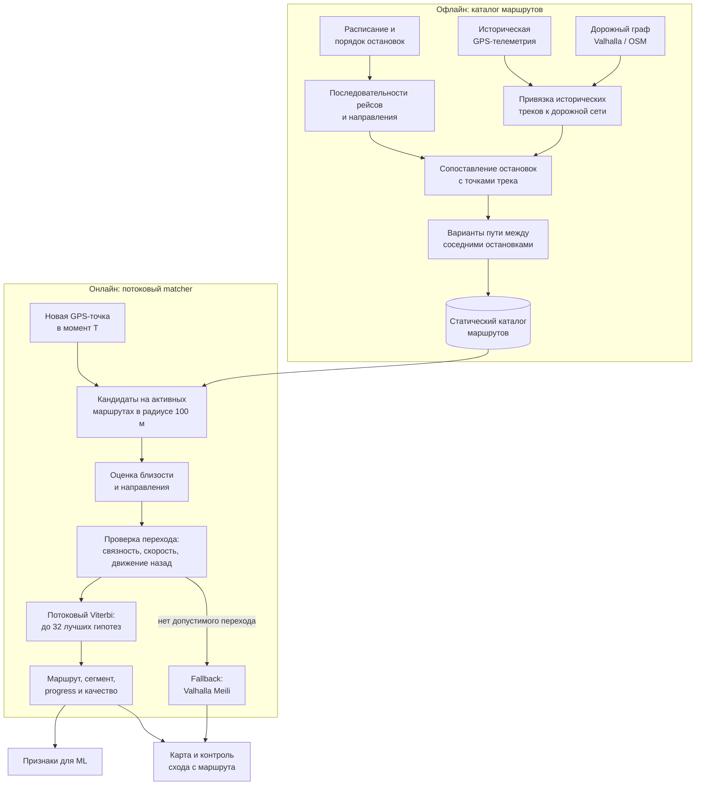
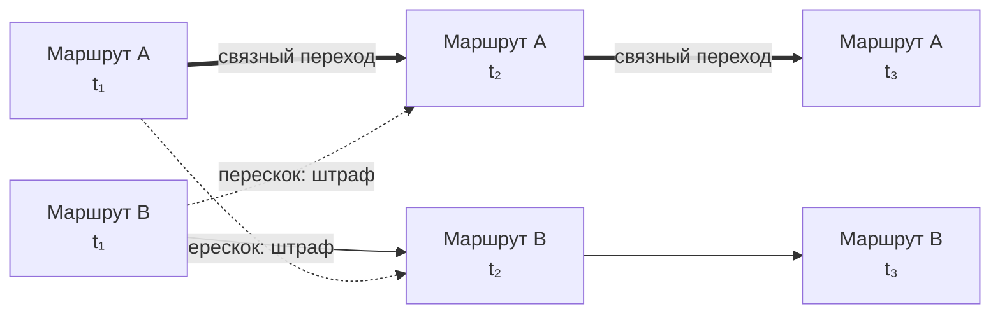

# Production ML

Навигация по ML-блоку. Здесь находятся подготовка признаков и inference сохранённых моделей; обучение и исследовательские эксперименты не входят в production runtime.

| Раздел | Содержимое |
|---|---|
| [Запуск и диагностика](docs/running/README.md) | CPU/GPU, Docker, health и fallback |
| [Данные и признаки](docs/pipeline/README.md) | Причинная история, map matching, окно TS2Vec и HTTP-контракт |
| [Как работает map matching](#map-matching) | Схема каталога маршрутов и потокового сопоставления GPS |
| [Модели и качество](docs/models/README.md) | Состав bundle, веса ансамбля, тесты и ограничения оценок |
| [Отчёт проверки интеграции](VERIFICATION.md) | Исторические замеры, воспроизведение прогнозов и открытые ограничения |
| [Backend](../backend/README.md) | Приём телеметрии, онлайн-детектор задержки и вызов ML |
| [Map matching](../map_matching/README.md) | Подготовка каталога и отдельный matcher дашборда |
| [Научный обзор](../research/deep-research-report.md) | Исследовательский контекст, не инструкция запуска |

## Карта кода

| Путь | Назначение |
|---|---|
| [app/main.py](app/main.py) | HTTP `/predict` и `/health` |
| [runtime/schema.py](runtime/schema.py) | Контракт запроса и валидация |
| [runtime/stream.py](runtime/stream.py) | История телеметрии и сборка запроса в backend |
| [runtime/features.py](runtime/features.py) | Признаки исходной телеметрии и планового расписания |
| [runtime/spatial.py](runtime/spatial.py) | Признаки положения на маршруте |
| [runtime/sequences.py](runtime/sequences.py) | Ресемплинг окна 45×7 |
| [runtime/components.py](runtime/components.py) | Run/dwell-компоненты |
| [runtime/encoder.py](runtime/encoder.py) | Замороженный TS2Vec encoder |
| [runtime/inference.py](runtime/inference.py) | Загрузка моделей, SHA256, ансамбль и деградация |
| [model/manifest.json](model/manifest.json) | Порядок признаков, нормализация и веса |
| [tests/test_predict.py](tests/test_predict.py) | HTTP, причинность, fallback и контрольные fixtures |

## Краткий запуск

По умолчанию используется сохранённый CatBoost v2 seed42. Обучение и данные
датасета для загрузки модели не нужны; PyTorch и NVIDIA не нужны.

```sh
docker compose up --build
```

GPU-режим — замороженный ансамбль №40: 0.66 среднего трёх v2 + 0.34 среднего
трёх гибридов v2+TS2Vec. Требуются NVIDIA GPU, драйвер с поддержкой CUDA 13
и настроенный NVIDIA Container Toolkit для Docker:

```sh
docker compose -f docker-compose.yml -f docker-compose.gpu.yml up --build
```

Не запускайте эти команды поверх рабочего проекта команды без согласования.
Для отдельной проверки задавайте уникальный Compose project и свободные порты.
При недоступном PyTorch/CUDA/encoder сервис переключается на seed42;
`GET /health` показывает `requested_mode`, `active_mode`, `degraded_reason`.
Если недоступен весь сервис, backend сохраняет fallback текущей задержки.
CPU-ансамбль намеренно не поддерживается. GPU-образ использует torch 2.14.0/cu130.
Одиночный запрос encoder дополняется независимыми копиями до batch=128:
это сохраняет CUDA-геометрию основного batch обучения/проверки. Сохранённый
хвост batch=23 имеет небольшие численные отличия — см. [проверки](VERIFICATION.md).
Для сетей с недоступным PyPI можно передать build argument `PIP_INDEX_URL`.

## Контракт и данные

`POST /predict`: `runtime/schema.py`, версия 2. Контекст прогнозной точки,
62 исходных маршрутных признака в порядке manifest, sequence ID и сырое
окно 45×7 (15 минут, шаг 20 секунд). Missing маршрутные значения — JSON null;
missing события окна — age=1. Сервис добавляет 6 run/dwell-признаков и,
только в ансамбле, 32 TS2Vec-признака. Выход: `prediction_delay_s`,
`late_probability` (null), `model_version`. HTTP округляет прогноз до 3 знаков.

Backend использует отдельный matcher с неизменным OSM-каталогом обучения;
matcher дашборда не заменяется. История сохраняет invalid GPS и дробные
секунды. При прогнозе используются только уже полученные события не позже T.
Сброс replay сбрасывает ML-историю и matcher. Последние старые пакет/GPS
сохраняются для возраста данных; рабочее окно ограничено 20 минутами.

Bundle в `model/` содержит только inference-веса, каталог и manifest с SHA256,
порядком признаков, нормализацией и весами ансамбля. Encoder — минимальная
inference-адаптация TS2Vec (MIT, см. runtime/TS2VEC_LICENSE), без SSL обучения.
Исследования и обучение остаются в ветке/worktree ml, не импортируются runtime.

## Map matching

Map matching преобразует шумный поток GPS-координат в положение транспортного
средства на известном маршруте. В отличие от простого поиска ближайшей дороги,
алгоритм учитывает последовательность наблюдений: предыдущую позицию, направление
движения, связность дорожных сегментов и физически возможную скорость.

На выходе система получает не только координату, «привязанную» к дороге, но и
структурированное состояние ТС: маршрут и направление, текущий сегмент между
остановками, прогресс по нему, оставшееся расстояние, скорость вдоль маршрута и
оценку качества сопоставления. Эти данные используются на карте и как признаки
ML-модели прогноза задержки.

### Общая схема



### Построение каталога

Каталог строится заранее из расписания, исторической телеметрии и локального
дорожного графа Valhalla. Исторические треки привязываются к дорогам, после чего
остановки сопоставляются с точками трека в правильном порядке. Полученные пути
между соседними остановками группируются по сходству, а типичный путь кластера
становится основной геометрией сегмента. Благодаря этому matcher работает не по
любой ближайшей дороге, а по реально наблюдавшимся вариантам движения маршрута.

Подход соответствует идее восстановления дорожной последовательности автобусного
маршрута по упорядоченным остановкам и историческим GPS-наблюдениям, описанной в
работе Zhou, Jiang & Jiang (2019).

### Сопоставление в потоке

Для каждой новой GPS-точки строятся возможные состояния:

```text
состояние = рейс + сегмент + вариант пути + ребро дороги + положение на ребре
```

Каждое состояние получает штраф за расстояние от GPS до маршрутной линии. Если
известен курс движущегося ТС, дополнительно учитывается расхождение направлений.
Затем проверяется переход из предыдущего состояния: расстояние вдоль маршрута
сравнивается с фактическим перемещением GPS. Переход отбрасывается, если он требует
несвязанного перескока, слишком большого движения назад или невозможной скорости.

```text
score новой гипотезы =
    score предыдущей гипотезы
    + соответствие текущей GPS-точке
    - штраф за неправдоподобный переход
```

Алгоритм хранит до 32 лучших гипотез и обновляет их при поступлении каждого пакета.
Это ограниченный потоковый вариант алгоритма Viterbi для HMM map matching. Он
устойчивее привязки к ближайшей дороге на параллельных улицах и перекрёстках,
поскольку выбирает согласованную последовательность положений, а не лучший
кандидат для одной точки.



Обработка причинная: состояние на момент `T` использует только телеметрию с
`event_time <= T`, а уже опубликованный snapshot не пересчитывается будущими
точками. При потере маршрутных гипотез matcher может временно обратиться к
Valhalla Meili и вернуть положение на дорожной сети. Сход с маршрута подтверждается
по нескольким последовательным наблюдениям, чтобы единичный выброс GPS не создавал
ложный инцидент.

### Источники

- Paul Newson, John Krumm. [Hidden Markov Map Matching Through Noise and
  Sparseness](https://www.microsoft.com/research/publication/hidden-markov-map-matching-noise-sparseness/),
  ACM SIGSPATIAL GIS, 2009, DOI: `10.1145/1653771.1653818` — HMM-постановка,
  emission/transition scores и поиск наиболее вероятной последовательности.
- Ying Zhou, Guiyuan Jiang, Guifeng Jiang. [Discover the road sequences of bus
  lines using bus stop information and historical bus
  locations](https://journals.sagepub.com/doi/10.1177/1550147719830552), 2019 —
  восстановление геометрии автобусных маршрутов по остановкам и историческим GPS.
- [Valhalla Map Matching API](https://valhalla.github.io/valhalla/api/map-matching/api-reference/)
  и [архитектура Meili](https://valhalla.github.io/valhalla/contributing/architecture/meili/) —
  используемый дорожный matcher и формат результатов привязки к графу.

## Проверки

```sh
python -m venv .venv
.venv/bin/pip install -r ml_service/requirements.txt pytest httpx
.venv/bin/python -m pytest ml_service/tests -q
.venv/bin/pip install pydantic-settings
.venv/bin/python -m pytest backend/tests -q
```

Контрольный fixture не содержит label. Метрики исследований: standalone seed42
MAE 62.965 с; ансамбль №40 MAE 63.228 с. Это разные сравнения, ансамбль не лучше
seed42 по этой метрике. Веса выбирались на официальном test, пересекающемся с
train по траекториям; эти оценки не являются независимой проверкой качества.
Воспроизведение с датасетным cur_dev_s проверяет реализацию, но не качество
онлайн-детектора задержки. Перед merge обязательны проверки актуального main,
реального GPU-контейнера и end-to-end replay; непроведённые проверки нельзя
считать пройденными. Результаты и открытые ограничения: [VERIFICATION.md](VERIFICATION.md).
