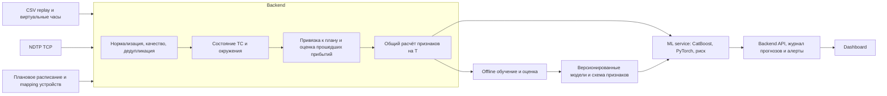

# Архитектура после чтения deep research

Дата: 25 сентября 2026. Это предложение команды, не требования организаторов. Реализация и обучение моделей в рамках этого разбора не выполнялись.

Прочитаны [отчёт](../research/deep-research-report.md), [задание](../task/assignment.md), README локального датасета, спецификация NDTP и существенные разделы [прежнего плана](plan_gpt6_astra.md). Дополнительно проверены CSV и ключевые первоисточники, перечисленные в конце.

## 1. Решение

Основной кандидат — CatBoost на состоянии ТС, плановой цели и последних минутах телеметрии. Сравнить прямой прогноз задержки и прогноз поправки к `cur_dev_s`. Небольшая PyTorch GRU — следующий эксперимент; контекст соседних ТС — отдельная проверяемая группа признаков. В первой версии не нужны Transformer, GNN, полноценный дорожный HMM и отдельные модели для каждого сегмента.

Главная архитектурная инвестиция — общий движок состояния и признаков, работающий причинно: на момент T он знает только доступное прошлое. Для онлайн-системы дополнительно нужен оценщик уже случившихся прибытий: значение `cur_dev_s` в NDTP не приходит.

## 2. Что проверено непосредственно в данных

| Проверка | Результат | Последствие |
|---|---|---|
| Train labels | 4 434 точки, 39 ТС | Это небольшой supervised-датасет |
| Train labels на ТС из реального test-расписания | 1 141 точка, 13 ТС | Остальные 3 293 точки относятся к дополнительным ТС; README описывает добавленные ТС как синтетические |
| Test labels | 353 точки, 13 ТС | Небольшие улучшения легко переоценить |
| Validate points | 151 точка, 11 ТС | Не использовать частые сабмиты как основной инструмент подбора |
| Период прогнозных точек | В основном 6 января; train до 7 января 00:25 | Названия train/test не означают последовательные дни |
| Телеметрия test и validate | Побайтово одинакова | Сами GPS-наблюдения не создают независимого holdout |
| Строки test-телеметрии, присутствующие в train | 99 988 по ключу `(tr_id, event_time, packet_id)` | При объединении источников нужна дедупликация; нельзя предполагать независимость файлов |
| Test/validate расписание | По 5 558 посещений, 847 уникальных значений `geom` | ID посещения нельзя считать ID физической остановки |
| Схема CSV | Нет `route_id`, `trip_id`, дверей, пассажиропотока, дорожных полилиний | Признаки маршрута, headway и dwell требуют восстановления и оценки уверенности |
| Сопоставление `unit_id → tr_id` в проверенных train/test | Не найдено неоднозначных `unit_id` | Можно собрать справочник; новые устройства требуют явной конфигурации |
| Persistence на test | MAE **93,36 с** | Фактический baseline для сравнения |
| Нулевой прогноз на test | MAE **103,34 с** | Локальная польза persistence умеренная; сама формулировка через residual не гарантирует сильную модель |
| Горизонт test/validate | 660–900 с | Проверять исходное правило `600 < target_time_begin − T ≤ 900`, не подменять его найденным минимумом |

Числа перепроверены проходом по CSV стандартной библиотекой Python. Полный аудит происхождения синтетики, покрытия соседями и качества восстановления прибытий ещё нужен. Совпадение телеметрии само по себе не означает утечку: для конкретной строки допустимость определяется временем события и правилами доступности. Но оно опровергает трактовку test как будущего периода.

## 3. Что взять из отчёта и что изменить

**Прогноз изменения задержки — хороший кандидат, но не доказанный победитель.**

`prediction = cur_dev_s + f(features)` удобно интерпретировать и использовать с persistence. Однако CatBoost не начинает автоматически «доверять baseline» при неопределённости. Для этого нужны проверенные на отложенных данных правила fallback либо регуляризация поправки. Сравнить прямой target, residual, MAE/RMSE objective на одинаковых признаках и разбиениях. Оптимизировать итоговый MAE, а не удобство формулы.

**Парк как датчик дорожной ситуации — полезная гипотеза с неизвестным покрытием.**

В test есть телеметрия 30 ТС. Этого может не хватить для устойчивой оценки каждого участка. Сначала измерить долю прогнозных точек с хотя бы одним другим свежим ТС рядом и согласованным направлением. Использовать число разных ТС, возраст наблюдений, разброс скорости и флаг отсутствия контекста. Исключать собственное ТС из peer-признаков. Частота пакетов одного автобуса не должна определять вес этого автобуса в агрегате.

**Недельная сезонность и модели на каждый сегмент пока не поддержаны объёмом данных.**

Из одного дня нельзя оценить эффект дня недели или погоды. Время суток применимо; недельные профили, внешние города и погодные API сейчас не приоритет. Для редких остановок предпочтительна одна общая модель с географическими признаками, а не сотни локальных моделей.

**Общий feature engine необходим, но его недостаточно для равенства offline/online.**

В файлах `cur_dev_s` дан организаторами, в потоке его надо оценивать. Даже идентичный код признаков даст другое качество, если заменить точную подсказку шумной GPS-оценкой. Этот разрыв должен иметь отдельную метрику и отдельный replay-эксперимент.

**Вероятность задержки — отдельный выход модели.**

Регрессионное значение 180 с не даёт вероятность 0,84. Для `P(delay > 120 с)` нужен классификатор либо проверенная вероятностная модель; калибровка оценивается на данных, не использованных для обучения. При малом объёме данных показывать ограниченность калибровки. До этого UI может показывать категорию прогнозируемого отклонения, но не выдуманную вероятность.

**Плановый горизонт и фактическое время инцидента различаются.**

По README цель выбирается по плановому прибытию через 10–15 минут. Это не гарантирует, что фактическое прибытие или начало затора случится через 10–15 минут. Хранить `issued_at`, `target_time_begin`, `forecast_horizon_s`; фактическую заблаговременность алерта оценивать отдельно, когда outcome становится доступен. Не заявлять, что один лишь выбор цели доказывает предсказание начала сбоя.

## 4. Компоненты и границы

Достаточно трёх сервисов в Docker: backend, ML, dashboard; эмулятор запускается отдельно. Общая Python-библиотека содержит контракты, state transitions, географию и feature engine, используется backend и offline CLI. ML-сервис принимает готовый табличный вектор и при необходимости последовательность, загружает модель один раз и поддерживает пакетный инференс. В основной репозиторий попадает только реализация; путь к данным — `DATA_DIR`, без зависимости от этого контекстного репозитория.

При таком размере парка начать с одного владельца состояния в backend, ограниченных буферов в памяти и простого сохраняемого журнала событий/прогнозов. Несколько web-workers не должны независимо владеть разными копиями состояния. Kafka и распределённое хранилище признаков пока не нужны. Сначала измерить задержку, возраст самого старого необработанного события и отсутствие роста очереди. Масштабирование позднее — разделение состояния по ТС с явно организованным обменом контекстом парка.

Минимальные контракты:

- `TelemetryEvent`: устройство, ТС, время измерения, время получения, GPS, скорость, курс, признаки качества, источник.
- `ForecastContext`: ТС, T, ID планового посещения, плановое время, `current_delay_s`, источник/возраст/уверенность текущего отклонения.
- `FeatureSnapshot`: версия схемы, признаки, маски отсутствия данных, последовательность, время последнего использованного события.
- `Prediction`: signed delay, вероятность late при наличии проверенной модели, горизонт, качество, возраст данных, версия модели и краткие основания прогноза.

Snapshot неизменяем после выдачи. Поздний пакет может улучшить последующее состояние, но не должен переписывать историческую оценку как будто его знали раньше.

## 5. Состояние, география и текущее опоздание

**Плановые посещения.** Внутри кода назвать `target_stop_id` яснее: `schedule_visit_id`. Физические остановки предварительно объединять по геометрии с проверкой адреса, направления и близких противоположных платформ. Идентификатор кластера не равен номеру маршрута. Из расписания доступна последовательность посещений ТС, но границы рейсов ещё надо восстановить.

**Привязка.** Первая версия: геозона остановки + порядок посещений + согласованность времени и направления + предыдущее состояние. Держать несколько кандидатов в неоднозначных местах или возвращать низкую уверенность. Не выбирать ближайшую остановку независимо в каждом кадре. Прямые отрезки между остановками использовать только как приблизительный геометрический признак, не как точную дорожную длину или подтверждённую трассу на карте.

**Оценка прибытий.** Причинный автомат `approaching → near_stop → passed`, с защитой от GPS-дребезга и повторного зачёта. После подтверждения посещения вычислять оценку `arrival_time − planned_time`. Хранить как оценённое время события, так и время его подтверждения: до подтверждения эту оценку нельзя использовать в старых прогнозах. Геозона/низкая скорость не дают точного факта посадки; оценить ошибку детектора на разрешённых фактах отложенных размеченных данных.

**Источник текущего отклонения.** В официальном offline-эксперименте использовать разрешённый `cur_dev_s`. В автономном replay и live — результат детектора с `source`, `age_s`, `confidence`. Если подтверждённого посещения нет, передавать missing; не представлять ноль как известное отсутствие задержки. Проверить модель с маскированием/шумом этого признака и отдельно модель без него. Параметры шума выводить из ошибок детектора на обучающей части.

**Окна.** Хранить до 15 минут телеметрии; признаки считать по интервалам 1/3/5/10 минут. Нерегулярные интервалы передавать явно. Длительное отсутствие пакетов не равно длительному стоянию. Для пропусков скорости и координат нужны отдельные маски и возраст последнего валидного измерения.

**Два понятия времени.** По правилам offline доступность определяется `event_time ≤ T`. В реальном сервисе дополнительно событие должно быть уже получено. Сохранять оба времени и отдельно проверять устойчивость при задержке доставки. Не вводить незаявленный фильтр `receive_time` в основной конкурсный эксперимент без проверки смысла этой колонки. Часовой пояс CSV не указан; преобразование naive-времени и Unix NDTP должно задаваться явной конфигурацией и проверяться при интеграции.

## 6. Модель и признаки

Первая таблица: `cur_dev_s`, горизонт, время суток, последние валидные GPS/скорость/курс, расстояние до цели, динамика этого расстояния, статистики скорости, доля наблюдаемого простоя, длина последней подтверждённой остановки, качество данных. Затем добавить плановый прогресс и число оставшихся посещений при уверенной привязке.

Сырые `sample_id`, `packet_id`, `target_stop_id`, `unit_id` не использовать как признаки. `tr_id` проверять отдельной абляцией: запоминание индивидуального профиля может помочь на этих данных, но плохо переносится на новые ТС. Пространственный ключ делать по физическому месту/направлению, не по ID посещения. Target-статистики остановок вычислять только внутри обучающего fold.

После базовой модели добавить соседей: свежая скорость других ТС, число наблюдавшихся ТС, направление, давность и географическое расстояние. Статистика «проезда сегмента» доступна только после его завершения. В отсутствие надёжной топологии это локальный географический контекст, а не доказанный headway на одном маршруте.

PyTorch-кандидат: одна GRU с hidden size порядка 32–64, окно 5–10 минут, `delta_t`, маски пропусков, скорость, относительные перемещения, признаки качества и целевой контекст. На выходе поправка к delay; второй выход late допускается как отдельный эксперимент. Это стартовая гипотеза, размеры и окно выбираются по проверке. Одна целевая остановка не требует полного seq2seq-decoder.

Ансамбль включать только при устойчивом выигрыше на временных folds и согласованном результате на test. Вес настраивать по out-of-fold прогнозам. Если регрессионная нейросеть не помогает, CatBoost остаётся основным предиктором; PyTorch-модель должна быть реально реализована и проверена в осмысленной роли, например как альтернативная модель или модель риска. Формальная заглушка не закрывает требование стека. Все обязательные компоненты продумать до финальной упаковки.

## 7. Проверка качества и запрет утечек

1. Официальный эксперимент: train labels → test labels. Это проверка на предоставленном наборе, а не на будущем дне. Фиксировать число экспериментов и заранее выбрать компактный набор сравнений.
2. Дополнительная проверка: несколько последовательных временных границ на реальных train-точках. Для границы C обучение использует только labels, чьи фактические целевые события уже произошли и доступны до C. Удалить пограничные примеры с ещё не известным target; не полагаться только на `T < C`. Группировать связанные примеры одного посещения/рейса. Окна истории в валидации могут содержать доступное прошлое до C — это нормальный онлайн-режим.
3. Синтетику сначала исключить из проверки временной переносимости. Сравнить обучение без неё, с пониженным весом и с полным весом после аудита происхождения. Производные одного реального рейса не должны попадать по разные стороны fold как независимые наблюдения.
4. В feature engine подавать whitelist плановых полей. `time_fact_begin` доступен только оценке/labels; не извлекать скрытые ответы из совпадающих расписаний. Техническая доступность столбца не делает его разрешённым признаком или дополнительной разметкой.
5. Любая нормализация, target encoding, выбор признаков, калибровка и вес ансамбля обучаются внутри соответствующего train-fold.
6. Отдельный автономный replay заменяет `cur_dev_s` GPS-оценкой. Показывать MAE официального режима и MAE автономного режима отдельно, а также покрытие и ошибку оценщика текущего отклонения.

Метрики: MAE, p90 абсолютной ошибки, ошибка по ТС, ранним/поздним прибытиям, величине текущего отклонения, качеству GPS и наличию соседей. Для риск-модели — precision/recall и качество вероятностей; для новых сбоев отдельно смотреть случаи, где ТС ещё не late на T. Небольшие выигрыши проверять по блокам времени/ТС; 353 коррелированных точки не дают уверенности от простого iid-bootstrap.

Инженерные проверки: добавление событий после T не меняет snapshot на T; offline/replay дают одинаковые признаки при одинаковом доступном префиксе; пропуски GPS не превращаются в нулевые координаты; дубли и повторный handshake не удваивают историю; обрыв связи не выдаёт старую позицию как свежую. TCP parser проверяется на разрезанный кадр, несколько кадров в чтении и повреждение CRC.

## 8. Алерты, деградация и демонстрация

Риск и качество данных — разные поля. Старые данные нельзя окрашивать зелёным как «всё хорошо». Fallback: основная модель → проверенная модель с неполной телеметрией → persistence, если есть приемлемая оценка текущего отклонения → исторический prior с низкой уверенностью либо явное отсутствие надёжного прогноза. Каждая ступень должна иметь проверку качества; автоматического улучшения от этого порядка нет.

Объяснения показывают наблюдаемые основания: падение скорости, длительное наблюдаемое стояние, сохраняющееся опоздание, похожее замедление соседей. Вклад признака не доказывает причинность: писать «наблюдается…» или «возможная причина…», не диагностировать ДТП по GPS. Дедуплицировать алерты по ТС/целевому посещению, использовать гистерезис и обновлять карточку вместо создания нового инцидента на каждый пакет.

Эмулятор присваивает текущее время и может генерировать случайное движение. Расписание датировано январём. Поэтому два отдельных режима:

- **Historical replay:** реальные траектории, план и виртуальное время, последовательное раскрытие событий, сохранённые прогнозы и последующее сравнение с разрешённым outcome.
- **Live NDTP:** настоящий бинарный TCP, mapping устройств, явно демонстрационное согласованное расписание и управляемые координаты. Не обещать движения по историческому маршруту от `autoGenerate`.

## 9. Порядок реализации

1. Контракты, аудит разбиений, baseline 93,36 с, общий причинный расчёт простых признаков.
2. CatBoost direct/residual и сравнение вариантов синтетики.
3. Работающий путь CSV replay → backend → ML → dashboard в Docker; NDTP-адаптер подключается к тому же состоянию.
4. Оценщик посещений и текущего отклонения, отдельный автономный replay. Это критическая часть live-качества.
5. Географический контекст других ТС, если хватает покрытия; маленькая PyTorch-модель и измеренный ансамбль/риск.
6. Проверка обрыва связи, задержки обработки, горизонта, документации и демонстрации.

Следующее решение о сложности принимать после базовой модели и разбора её ошибок. Если ошибки приходятся на неверный прогресс/текущую задержку, улучшать состояние и привязку. Если на участки с общим замедлением — контекст парка. Если табличные агрегаты теряют форму траектории — проверять GRU.

## 10. Статьи и какие полные тексты нужны

В отчёте ссылки сохранены как внутренние маркеры `turn…`, поэтому его библиография сама по себе не позволяет перейти к первоисточникам. Ниже восстановленные источники, использованные в этом разборе; остальные численные результаты отчёта независимо не перепроверялись.

| Работа | Что подтверждено и что переносим | Нужен ли файл от пользователя |
|---|---|---|
| Wai, Zhou (2020), [*Designing and Implementing Real-Time Bus Time Predictions using Artificial Intelligence*](../research/papers/Wai_Zhou_2020_Real_Time_Bus_Time_Predictions.pdf), [DOI](https://doi.org/10.1177/0361198120947715) | Прочитан полный текст: отдельные XGBoost-модели run/dwell на двух годах истории, не CatBoost; локальная модель требует не менее 500 событий. Для наших данных переносим плановое время и прогресс, но не тысячи локальных моделей | Уже есть и прочитан |
| Yu et al. (2018), *Prediction of Bus Travel Time Using Random Forests Based on Near Neighbors*, [DOI](https://doi.org/10.1111/mice.12315), [полный текст](https://www.sciencedirect.com/science/article/pii/S1093968726011539) | Скорости и вариативность предыдущих автобусов на текущем/следующем сегментах. Переносим идею признаков, а не дорогую процедуру RFNN | Не обязателен: существенные разделы доступны онлайн; PDF удобен для архива |
| Bhutani, Pachal, Achar, [arXiv:2210.01655](https://arxiv.org/abs/2210.01655), [полный текст v2](https://arxiv.org/html/2210.01655v2) | В v2 последовательность организована по участкам пути, с синхронизированными данными предыдущих проездов. Это не прямое доказательство преимуществ GRU по сырым GPS. Маленькая temporal GRU для нас — самостоятельная гипотеза | Не обязателен: доступен полный текст. Предпочтительна v2 от 31.08.2024, заголовок внутри *Encoder-Decoder RNNs for Bus Arrival Time Prediction* |
| Newson, Krumm (2009), [*Hidden Markov Map Matching Through Noise and Sparseness*](../research/papers/Hidden%20Markov%20Map%20Matching.pdf) | Прочитаны формулировка и алгоритм: дорожные сегменты как состояния, GPS emission, разность дорожного и прямого расстояний в transition, Viterbi | Уже есть. Для первой версии не воспроизводить целиком |

У Newson–Krumm в разделе 3 прямо указана batch-постановка после сбора всех данных; sliding window предлагается как возможная адаптация к real-time. Для нашего T запрещено сначала восстановить путь по полному дню, а затем нарезать признаки: будущие координаты уже повлияют на состояние. Допустим matcher по префиксу до T с фиксацией выданного snapshot. Без дорожного графа модель на последовательности остановок будет нашей отдельной адаптацией, а не реализацией исходного алгоритма.

Полные тексты BAT-Transformer, ArrivalNet и GNN сейчас не являются блокером. Их стоит добавлять, когда появятся конкретные ошибки baseline, требующие длинного или сетевого контекста. Начинать реализацию предложенной архитектуры можно без ожидания новых PDF.

### Уточнение после полного текста Wai–Zhou

Статья не является прямым рецептом модели для этого датасета. Её target — отдельные run/dwell durations, а итоговый ETA рекурсивно агрегируется по известной последовательности маршрута. В нашей раздаче нет route/pattern, фактов прибытия и отправления по отдельности, а размеченных прогнозных точек значительно меньше. Поэтому первая реализация использует одну общую CatBoost-модель задержки и проверяет direct/residual постановки. Прогресс до цели, плановый интервал и свежесть GPS переносятся как признаки; decomposition откладывается до появления надёжного детектора посещений.
