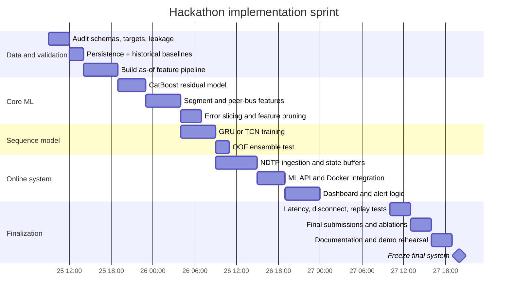

# Bus Delay Prediction for the Moscow Transport Hackathon: Literature Review and ML Architecture Recommendation

## Executive summary

The hackathon task is narrower—and in several ways easier to optimize—than the generic “bus ETA prediction” problem in much of the literature. At each prediction time \(T\), the target stop is already known and its scheduled arrival lies strictly **10–15 minutes ahead**; the target is the **signed delay in seconds** at that stop. The data also provide `cur_dev_s`, the delay at the last already-passed stop, and prohibit using telemetry after \(T\). The supplied baseline simply carries `cur_dev_s` forward and scores about **0.40**, so the most natural ML formulation is not “predict delay from scratch,” but **predict how the current delay will evolve over the next 10–15 minutes**. fileciteturn0file1

My recommended hackathon design is therefore:

\[
\boxed{
\hat d_{\text{target}}
=
d_{\text{current}}
+
\widehat{\Delta d}_{10-15m}
}
\]

where a **CatBoost residual model** predicts \(\Delta d = d_{\text{target}}-d_{\text{current}}\) from leakage-safe telemetry aggregates, route/stop context, schedule progress, and fleet-level traffic proxies. A **small PyTorch GRU or TCN** should be trained in parallel on the recent 5–10 minutes of raw telemetry; blend it with CatBoost only if strict chronological validation shows a reproducible MAE improvement. This directly satisfies the required CatBoost/PyTorch stack while preserving a fast, robust tabular model as the operational backbone. The brief explicitly requires Python 3.12+, PyTorch, CatBoost, Docker, independent backend/ML modules, streaming NDTP processing and low inference latency, with an indicative real-time target below roughly 1–2 seconds. fileciteturn0file0

The literature strongly supports this order of effort. Gradient boosting has beaten historical-average and linear models on archived bus AVL/GPS arrival prediction; production work at TransLink successfully decomposed predictions into segment run-time and stop-dwell components; GRU/LSTM models repeatedly improve on simple baselines when recent trajectories and preceding-trip information are available. citeturn15search2turn15search3turn14academia36 By contrast, recent Transformer and graph models can be excellent where there is enough network-scale data and topology, but their added engineering burden is harder to justify in a short hackathon. A 2024 BAT-Transformer study reported RMSE of 92 s and showed gains over several neural baselines, while newer graph-based work shows further improvements when explicit stop/road topology is available. citeturn13search0turn13search2turn13search3

A second important finding is that **fleet telemetry can substitute for an external road-traffic feed**. Earlier Random-Forest work explicitly used the speeds and speed variance of preceding buses to represent current segment traffic; this is particularly relevant here because the hackathon provides telemetry for vehicles without prediction labels as additional context. citeturn15search0 fileciteturn0file1 This suggests high-value features such as “median speed of buses recently traversing the next segment,” “preceding bus delay,” and headway/bunching measures.

The largest modeling risk is not architecture but **validation leakage and domain shift**. The train set contains synthetic vehicles while test and validate are fully real, according to the supplied README. fileciteturn0file1 Random-row cross-validation, unrestricted vehicle-ID embeddings, or rolling features accidentally incorporating observations after \(T\) can therefore produce deceptively strong local scores. Evaluation should be chronological, feature computation should enforce `event_time <= T` by construction, and real test performance should dominate architecture decisions.

The practical priority order is:

**CatBoost residual regression → stronger leakage-safe segment/fleet features → small GRU/TCN → out-of-fold ensemble → only then GNN/Transformer experiments.**

ARIMA/SARIMA and Prophet belong in the baseline suite rather than the final online model. ARIMA-family methods remain useful for recurring segment-level patterns, but classical time-series approaches are awkward when every forecast depends on rich, rapidly changing vehicle and network covariates. Prophet is even less aligned with this target: the bus-delay literature reviewed here provides little direct evidence for Prophet at the individual-vehicle, 10–15-minute delay horizon, whereas tree ensembles, state-space models, and recurrent models have much stronger bus-specific evidence.

## Problem framing and what the literature implies

### The hackathon target is delay propagation, not generic ETA

Most papers are titled “bus arrival-time prediction” or “bus travel-time prediction,” but they generally solve one of three related tasks:

| Literature formulation | Typical target | Granularity | Relevance to this hackathon |
|---|---|---|---|
| ETA prediction | Seconds/minutes until a future stop | Vehicle → stop | Relevant, but schedule information must then be converted to delay |
| Segment travel-time prediction | Running time between adjacent stops/road segments | Segment | **Very relevant as an intermediate feature/model** |
| Schedule-delay prediction | Actual minus planned arrival | Stop/event | **Exact conceptual match** |

The hackathon gives `target_stop_id`, `target_time_begin`, prediction time `T`, and `cur_dev_s`; the target is `target_delay_s` at the first stop scheduled within \((T+10\,\mathrm{min},T+15\,\mathrm{min}]\). Only information available at or before \(T\) may be used. fileciteturn0file1 This turns the forecasting problem into a short-horizon state-transition problem:

\[
d_{t+h}
=
d_t
+
\underbrace{\text{extra running-time deviation}}_{\text{traffic}}
+
\underbrace{\text{extra dwell-time deviation}}_{\text{stops/passengers}}
+
\underbrace{\text{control/recovery effects}}_{\text{schedule management}}
\]

That decomposition has a long pedigree. Early real-time transit work used AVL/APC and Kalman-style models to separately account for running and dwell behavior, while TransLink's later production-oriented system explicitly trained segment travel-time and stop-dwell models and then combined them to generate downstream predictions. citeturn15search3 The architectural lesson is more important than copying a particular algorithm: **model the causes of delay change, rather than treating latitude/longitude as opaque coordinates.**

### Data modalities and their value

The most useful literature can be organized around the data source rather than the neural architecture.

**AVL/GPS and GTFS/route geometry are the core.** GTFS Realtime's standard `VehiclePosition` representation contains vehicle location plus trip association and can optionally contain current stop, bearing and speed; `TripUpdate` represents schedule deviations and future stop predictions. citeturn14search5turn14search1 The hackathon's decoded telemetry is analogous: `traffic.csv` includes vehicle ID, timestamps, position, speed, heading and location-validity information, at roughly 12–15-second spacing. fileciteturn0file1

**APC is primarily useful through dwell time.** Passenger boarding/alighting counts explain why otherwise similar road segments can have different stop delays. The literature frequently combines APC and AVL for this reason, and the Random-Forest study by Yu et al. explicitly treats dwell time as part of inter-stop travel time. citeturn15search4 The released hackathon CSV does not list APC counts, so APC should not be a dependency of the core solution; use zero-speed/dwell proxies and door state if the live NDTP stream exposes it. The assignment explicitly mentions door status among the streaming telemetry attributes. fileciteturn0file0

**Traffic can be inferred from the fleet itself.** Yu et al. used speed and speed variance from preceding buses on current/downstream segments as current-traffic variables. citeturn15search0 This is highly transferable: construct rolling route-segment statistics from all vehicles with timestamps before \(T\). It is cheaper and more robust for the hackathon than integrating a third-party road-traffic API.

**Weather, calendar and incidents help, but are second-order hackathon work.** TransLink included calendar and weather data in its production-oriented model, while recent Transformer work uses time-of-day, weekday/weekend, rush-hour and road-context variables. citeturn15search3turn13search0 GTFS Service Alerts also provides a standard representation for network disruptions and affected entities. citeturn14search8 However, because the supplied scoring data do not explicitly include weather or event feeds, external joins introduce timestamp/geolocation alignment risk; they should be added only after the internal telemetry model is strong.

### Real-time engineering matters as much as offline accuracy

GTFS Realtime best practices recommend refreshing feeds at least every 30 seconds or whenever positions change, and recommend that vehicle-position and trip-update observations not be older than 90 seconds. citeturn14search0 The hackathon telemetry arrives more frequently, roughly every 12–15 seconds. fileciteturn0file1 This means an online system should maintain rolling state rather than repeatedly scanning full CSV histories.

A production-suitable pattern is:

1. decode one telemetry update;
2. update a ring buffer keyed by vehicle;
3. update route/segment aggregates;
4. calculate the current feature vector in \(O(1)\) or near-\(O(1)\);
5. infer;
6. publish the prediction plus risk and explanation.

This also keeps offline and online feature definitions identical. The assignment explicitly evaluates continuous NDTP ingestion, end-to-end streaming prediction, degraded operation after communication loss, throughput and inference latency. fileciteturn0file0

### Metrics need to match the competition target

The platform's primary metric is **MAE in seconds**, followed by a normalized score relative to a zero-delay reference and a target MAE; the included `cur_dev_s` persistence submission is reported at approximately 0.40 score. fileciteturn0file1 MAE therefore—not RMSE or MAPE—must drive model selection.

Research papers often report RMSE and MAPE alongside MAE. For example, the 2018 RFNN work reports MAE, MAPE and RMSE, and BAT-Transformer uses RMSE/MAPE as key criteria. citeturn15search0turn13search0 MAPE is a poor primary metric for this hackathon because the target is signed and often near zero: division by a small true delay makes percentage error unstable. Report it only for literature comparability, not for leaderboard optimization.

The useful local metric set is therefore:

\[
MAE = \frac{1}{n}\sum_i |y_i-\hat y_i|
\]

plus median absolute error, RMSE, 90th-percentile absolute error and operational threshold accuracies:

\[
P(|e|\le30s),\quad P(|e|\le60s),\quad P(|e|\le120s)
\]

For the dashboard, additionally score the supplied `early` / `ontime` / `late` categories based on the README's −60 s and +120 s thresholds, but keep this classification layer secondary to MAE regression. fileciteturn0file1

## Prioritized annotated reading list

### Essential papers to read before building the model

**Wai & Zhou, “Designing and Implementing Real-Time Bus Time Predictions using Artificial Intelligence,” Transportation Research Record, 2020 — highest practical priority.** This TransLink paper is unusually valuable because it covers not just an ML model but a production-tested prediction algorithm: separate segment run-time and stop-dwell models, calendar/weather features, handling missing models, schedule changes, partially traversed segments, and a scalable serving architecture. It is the closest literature match to the hackathon's combination of ML accuracy and real-time deployment. citeturn15search3

**Bhutani, Pachal & Achar, “Public Transit Arrival Prediction: a Seq2Seq RNN Approach,” 2022 preprint.** The authors use a GRU encoder-decoder for real-time bus-arrival prediction and explicitly inject synchronized information from previous trips to model congestion. The strongest transferable idea is not necessarily Seq2Seq itself, but **using recent preceding buses as dynamic network context**, which maps naturally onto the hackathon fleet telemetry. citeturn14academia36

**“Bus Journey and Arrival Time Prediction based on Archived AVL/GPS data using Machine Learning,” IEEE MT-ITS, 2021.** The study compares linear regression, ANN and LSTM for journey time, and historical averaging, linear regression and gradient boosting for stop arrivals; gradient boosting was the strongest arrival-time model in its experiments. This directly supports trying CatBoost before assuming deep learning is necessary. citeturn15search2

**Yu et al., “Prediction of Bus Travel Time Using Random Forests Based on Near Neighbors,” Computer-Aided Civil and Infrastructure Engineering, 2018.** The paper derives real-time traffic conditions from preceding buses using segment average speed and speed variance and compares RFNN against LR, KNN, SVM and standard RF. Its most important hackathon contribution is the feature-engineering blueprint: **fleet-derived segment traffic** can provide the context that a single vehicle's trajectory cannot. citeturn15search0turn15search4

**Yumaganov & Agafonov, “Bus Arrival Time Prediction Using Recurrent Neural Network with LSTM Architecture,” 2019 — Russia-relevant.** Researchers from Samara National Research University evaluate an LSTM on Samara bus-route data using both statistical and real-time traffic information and explicitly target large-scale real-time public-transport prediction. It is worth reading because the operating context and Russian urban-transit environment are closer to Moscow than most benchmark studies. citeturn15search1

### Recent deep-learning directions worth knowing

**“BAT-Transformer: Prediction of Bus Arrival Time with Transformer Encoder for Smart Public Transportation System,” Applied Sciences, 2024.** This peer-reviewed study incorporates temporal/location/context features into a Transformer encoder and reports an RMSE of 92 s, outperforming the compared LSTM, GRU, Bi-LSTM, FCNN and vanilla Transformer configurations in its experiment. Its preprocessing and contextual feature design are more directly useful for the hackathon than reproducing its eight-layer Transformer. citeturn13search0

**Li, Wolf & Wang, “ArrivalNet: Predicting City-wide Bus/Tram Arrival Time with Two-dimensional Temporal Variation Modeling,” 2024 preprint.** ArrivalNet transforms temporal data into multi-frequency two-dimensional blocks and uses CNN/residual processing, adding workday, peak-hour and intersection context. On 125 days of Dresden public-transport data, the authors report at least 6.1% lower RMSE, 14.7% lower MAE and 34.2% lower MAPE versus their state-of-the-art baselines. citeturn14academia38

**“Regional Bus Travel Time Prediction Using Graph Neural Networks,” Journal of Transportation Engineering, Part A: Systems, 2026.** This recent work explicitly formulates regional bus arrival/travel-time prediction as graph time-series forecasting and constructs a graph containing both stations and interstation road nodes, then combines convolution, attention and graph convolution. It is an important indication of where the field is moving, but requires reliable topology that the hackathon may not provide cleanly enough for a first implementation. citeturn13search2

**“A Graph Convolutional Network with Attention Mechanism for Bus Arrival Time Prediction,” Applied Sciences, 2026.** This very recent paper models section travel time and dwell behavior with spatio-temporal graph components; for its section-travel task it reports MAEs as low as 10.72 s inbound and 8.60 s outbound for its DSTGCN, outperforming listed Bi-LSTM, Transformer and other graph baselines on that dataset. These absolute values are dataset-specific and should not be compared directly with the Moscow MAE, but they show the value of explicit spatial structure when sufficient data exist. citeturn13search3

**Xie et al., “Multistep Prediction of Bus Arrival Time with the Recurrent Neural Network,” 2021.** This work tests multiple RNN-family configurations for multistep downstream arrival prediction and reinforces the suitability of LSTM/GRU-type sequence models for ordered stop and trajectory data. It is useful for deciding how to structure a compact PyTorch branch without jumping to a Transformer. citeturn15search5

### Classical and hybrid work that still matters

**Random Forest / ensemble evidence.** A 2022 Beijing TOCC study compares LSTM, LR, KNN, XGBoost and GRU base models plus Random-Forest, AdaBoost and stacking ensembles; in that experiment the ensemble models improved over their component models and the RF-based ensemble was strongest. The lesson is that bus prediction is often won by combining complementary tabular and temporal signals rather than by choosing the newest architecture. citeturn15search6

**Kalman/state-space models remain strong conceptual baselines.** Even when the final implementation is CatBoost/GRU, Kalman-style thinking is useful: maintain a latent current delay/travel-time state and update it as new telemetry arrives. Modern ML can be viewed as learning the nonlinear correction to that state rather than repeatedly estimating everything from zero.

**ARIMA/SARIMA remain reasonable historical baselines, not first-choice online predictors.** They are most natural for segment travel-time series where strong recurring time-of-day patterns dominate. Once current speed, current delay, vehicle progress, preceding buses and schedule context are available, supervised tabular/sequence models can use considerably richer conditioning information.

**Prophet should be treated as an optional aggregate baseline.** In the literature search for this report, I did not find a strong, directly comparable peer-reviewed body of Prophet-based individual-bus delay forecasting at a 10–15-minute horizon. It is useful for periodic aggregate demand or route-level series but is poorly matched to per-vehicle state transitions; spending hackathon time on Prophet before CatBoost/GRU would be difficult to justify.

### Influential older work and Russian-language context

**Агафонов А. А., Мясников В. В., “Алгоритм оценки времени прибытия общественного транспорта с использованием адаптивной композиции элементарных прогнозов,” Компьютерная оптика, 2014.** This Russian-language paper proposes an adaptive composition of multiple simple predictors for public-transport arrival time. Despite its age, it is relevant to an ensemble strategy: combine individually inexpensive predictors whose usefulness varies by operating regime rather than relying on one global rule. citeturn14search4

The older AVL/APC/Kalman/SVM literature is also conceptually influential because it established several principles that remain valid under deep learning: model current vehicle state, exploit preceding buses, separate running from dwell time, and continuously correct predictions with real-time observations. The modern architectures mainly improve the function approximator; they do not remove the need for these transit-specific representations.

## Method comparison and evidence

Performance values below should **not** be compared horizontally as though they came from one benchmark: routes, cities, prediction horizons and target definitions differ substantially. The useful comparison is architectural and operational.

| Model family | Typical inputs and granularity | Representative evidence | Common metrics | Strengths | Weaknesses for this hackathon |
|---|---|---|---|---|---|
| **Persistence / schedule baseline** | Current delay, scheduled target time; stop level | Hackathon `prediction = cur_dev_s` gives about 0.40 score. fileciteturn0file1 | MAE | Zero training cost; extremely robust; mandatory baseline | Cannot anticipate new congestion/dwell changes |
| **Historical average / time bucket** | Stop/segment × weekday × time bucket | Used as a comparator in AVL/GPS studies. citeturn15search2 | MAE/RMSE | Fast; interpretable; excellent fallback | Cannot react well to incidents |
| **ARIMA/SARIMA** | Univariate or small multivariate segment series; segment/route level | Long-established transit-time-series family | MAE/RMSE/MAPE | Captures periodic/autocorrelated patterns; easy benchmark | Per-segment model management; limited nonlinear covariates; awkward fleet context |
| **Prophet** | Aggregate route/segment periodic series | Little direct evidence for individual 10–15 min bus-delay prediction found in this review | MAE/RMSE | Convenient trend/seasonality baseline | Poor fit to event-level signed delay propagation; low priority |
| **Kalman/state-space** | Current estimated state + latest AVL; vehicle/segment | Foundation of real-time AVL prediction approaches | MAE/RMSE | Online updates are computationally cheap; handles noisy observations naturally | Linear/Gaussian assumptions unless extended; requires state model design |
| **Random Forest** | Current and preceding-bus speed, dwell, route/segment context | RFNN achieved better accuracy than LR/KNN/SVM/RF comparisons, though its neighbor-search implementation was computationally expensive. citeturn15search0 | MAE, RMSE, MAPE | Strong nonlinear baseline; interpretable; little preprocessing | Plain RF less capable than modern boosting on many tabular tasks; large forests can cost latency |
| **Gradient boosting / XGBoost / CatBoost** | Rich tabular state: current delay, rolling speeds, segment, time, peer buses | Gradient Boosting beat historical average/LR for bus-stop arrival prediction in the 2021 AVL/GPS study. citeturn15search2 | MAE/RMSE | **Best hackathon effort/accuracy ratio**; fast inference; handles interactions and missingness | Needs handcrafted temporal summaries; does not directly learn long sequences |
| **LSTM / GRU** | Ordered telemetry window plus historical/preceding-trip context; vehicle/route | Samara LSTM supports real-time network-scale use; GRU Seq2Seq explicitly adds preceding-trip context. citeturn15search1turn14academia36 | MAE/RMSE/MAPE | Natural for telemetry trajectories; compact models can run quickly | More tuning/data sensitivity; sequence construction and padding complexity |
| **TCN / temporal CNN** | Recent fixed-length sequence; vehicle/segment | Used broadly in spatio-temporal transport models; conceptually suited to short fixed windows | MAE/RMSE | Parallel training/inference; controllable receptive field; stable gradients | Less directly represented in classic bus-specific literature than LSTM/GRU |
| **Transformer** | Longer sequences plus temporal/spatial/context tokens | BAT-Transformer reports RMSE 92 s and improvement over several neural baselines on its dataset. citeturn13search0 | RMSE/MAPE/TWE | Flexible long-range interactions; easy covariate fusion | More parameters and tuning; long-range attention may be unnecessary for a short 5–10 min input window |
| **GNN / ST-GNN** | Stop/road graph × temporal node features; network level | 2026 regional GNN work models stations and interstation roads explicitly; recent DSTGCN results show strong section prediction. citeturn13search2turn13search3 | MAE/RMSE/MAPE | Explicitly captures congestion propagation/network dependence | Graph construction/map matching is a project in itself; high hackathon opportunity cost |
| **Hybrid / ensemble** | Tabular + recent sequence + optionally graph context | Production and research literature repeatedly separates or combines complementary components. citeturn15search3turn15search6 | MAE + operational metrics | Usually strongest risk-adjusted design; graceful fallback | Must validate blending correctly; more deployment components |

### Feature engineering by evidence and expected value

For this competition, **features are likely more important than replacing CatBoost with a more sophisticated architecture**. The key feature groups are:

| Feature group | Recommended variables | Evidence / reasoning | Priority |
|---|---|---|---|
| Current schedule state | `cur_dev_s`, horizon seconds, target planned time, previous-stop delay | The supplied baseline based on `cur_dev_s` already has meaningful skill. fileciteturn0file1 | **Critical** |
| Recent vehicle dynamics | last/mean/median/min/max/std speed; acceleration; stop fraction; zero-speed streak; distance travelled over 1/3/5/10 min | Captures emerging congestion, dwell and recovery before visible schedule impact | **Critical** |
| Spatial progress | distance to target, distance/progress since last stop, number of stops remaining, segment ID, target stop ID | Recent Transformer work explicitly uses distance-to-stop and route context. citeturn13search0 | **Critical** |
| Fleet-derived traffic | segment median speed, speed variance, preceding-bus speed/delay, number of active buses | Direct precedent in RFNN, where preceding-bus speeds represent traffic. citeturn15search0turn15search4 | **Very high** |
| Temporal context | hour, minute-of-day sine/cosine, weekday, weekend, peak-period flag | Used across production and recent deep-learning systems. citeturn15search3turn13search0 | **High** |
| Dwell proxies | time stationary near stop; low-speed duration; door state where available | Segment run time and stop dwell are separately modeled in production literature. citeturn15search3 | **High** |
| Headway / bunching | time/distance to preceding and following same-route vehicle; difference in delays | Bus interactions often expose congestion and bunching earlier than one-vehicle features | **High if route assignment is reliable** |
| Data quality | GPS validity fraction, telemetry age, missing packet count, last fix age | Streaming sources can be stale; official GTFS guidance explicitly emphasizes measurement timestamps and freshness. citeturn14search0turn14search5 | **High for production** |
| Weather | precipitation, temperature, severe-weather flag | Used in TransLink's production-oriented model. citeturn15search3 | Medium |
| Events/incidents | network alert, affected route/segment, event-zone indicator | GTFS Service Alerts explicitly model disruptions. citeturn14search8 | Medium / stretch |
| Passenger/APC | boarding/alighting, load, occupancy | APC affects dwell time and is historically useful, but not exposed as a core field in the supplied CSV. citeturn15search4 fileciteturn0file1 | Only if available |

## Recommended hackathon architecture and evaluation plan

### Recommended core model: CatBoost residual delay

The first model I would expect to submit is:

\[
r_i = y_i-\texttt{cur\_dev\_s}_i
\]

\[
\hat r_i = f_{\text{CatBoost}}(X_i)
\]

\[
\hat y_i = \texttt{cur\_dev\_s}_i + \hat r_i
\]

This formulation turns the learning problem into: **what will happen to today's already-known schedule deviation over the next 10–15 minutes?**

That is preferable to direct prediction for four reasons.

First, the carry-forward value is already the supplied baseline, so the model is learning only the correction required to beat it. fileciteturn0file1

Second, many inputs naturally explain **delay change**: reduced speed creates additional positive delay, uninterrupted fast running may recover delay, and prolonged dwell adds delay.

Third, it lets the model shrink naturally toward zero residual when it is uncertain, preserving the strong baseline.

Fourth, residual distributions are often easier for a compact model to learn than full absolute arrival-state variation, especially when stop/time fixed effects are large.

Use a CatBoost regression objective aligned as closely as practical with absolute error and compare it with an RMSE-trained variant on the official test MAE. Because the train set includes synthetic vehicles whereas test/validate are real, avoid aggressive dependence on `tr_id`; vehicle ID may be useful for diagnostics but route/stop/spatial/temporal context should carry most of the predictive load. fileciteturn0file1

### Recommended second model: compact GRU or TCN sequence encoder

Create, for every prediction point \(T\), a fixed recent window ending **strictly at \(T\)**:

\[
X_{\text{seq}}\in\mathbb{R}^{L\times F}
\]

With the supplied 12–15-second telemetry cadence, a 10-minute history corresponds to roughly 40–50 raw observations per vehicle. fileciteturn0file1 A small sequence model does not need to be large:

```text
10-minute telemetry window
        ↓
speed, Δspeed, distance increment,
route-progress increment, stop flag,
GPS-valid flag, relative time
        ↓
2-layer GRU, 64–128 hidden units
    OR small dilated 1D TCN
        ↓
sequence embedding
        + static/context features
        + cur_dev_s
        ↓
small MLP
        ↓
predicted residual delay
```

GRU has particularly direct bus-specific support: the 2022 Seq2Seq work uses a GRU encoder-decoder and synchronized previous-trip information for real-time arrival prediction. citeturn14academia36 LSTM is equally defensible and has Russian/Samara evidence. citeturn15search1

For a short hackathon I would choose **GRU before Transformer**. The target horizon is only 10–15 minutes and the most informative raw input window will probably be 5–10 minutes, so the sequence length is modest. Transformer capacity becomes more compelling only after proving that substantially longer historical context adds value. Although BAT-Transformer demonstrates that attention can beat recurrent baselines in a suitable dataset, that result does not imply it will dominate a smaller, short-horizon Moscow competition dataset. citeturn13search0

### Ensemble only on evidence

Generate out-of-fold predictions from both branches and fit a single blending weight:

\[
\hat y =
\alpha\hat y_{\text{CatBoost}}
+
(1-\alpha)\hat y_{\text{GRU}}
\]

Do not assume a 50/50 blend. Search \(\alpha\) only using leakage-safe chronological validation, then round to a simple robust value. If the neural branch does not beat CatBoost or produce complementary residuals, do not deploy it merely because PyTorch is in the required stack; it can instead support a secondary risk classifier or anomaly detector while CatBoost performs the main regression. The assignment requires the technology stack and modular ML capability, but operational accuracy is explicitly scored. fileciteturn0file0

### Stretch architecture: graph context without a full GNN

Before implementing a full GNN, approximate message passing through engineered neighbor statistics:

\[
\text{segment\_context}_{s,t}
=
\{
\operatorname{median}(v),
\operatorname{std}(v),
\operatorname{median}(delay),
n_{\text{vehicles}}
\}_{s,t-\Delta:t}
\]

and similarly for one or two downstream segments.

This captures much of the inductive bias that makes a GNN attractive—nearby vehicles share traffic conditions—without requiring graph construction, batching and graph-serving infrastructure. The RFNN literature already validates exactly this “preceding buses as traffic sensors” idea. citeturn15search0

A real GNN becomes worthwhile only when the stop/segment topology is reliable and there is enough time to construct graph snapshots. Recent work supports station-plus-road-node graphs and attention/GNN combinations for regional prediction, but this should be treated as a stretch goal rather than the core hackathon bet. citeturn13search2turn13search3

### Data preprocessing pipeline

The preprocessing pipeline should be designed around a single invariant:

> **No feature calculator may see an event whose timestamp is greater than the sample's \(T\).**

That is explicitly required by the competition and should be enforced in code rather than remembered during feature engineering. fileciteturn0file1

A safe pipeline is:

**Timestamp normalization.** Parse all event, GPS, receive, schedule and prediction timestamps once into a consistent timezone/reference representation; sort by `(tr_id, event_time)` and remove exact duplicates.

**Telemetry quality filtering.** Respect `location_valid`; reject clearly impossible coordinate jumps and retain missing/invalid indicators rather than silently filling everything. Stale location age should become a feature, because a delayed packet and a genuinely stationary bus are operationally different.

**As-of joins.** For every prediction point, select the last vehicle observation and rolling window using an as-of operation whose direction is backward. Never perform ordinary joins followed by time filtering if the implementation can accidentally leak future rows.

**Spatial alignment.** Match the current vehicle position to its scheduled stop sequence or route segment. If accurate route polylines are unavailable, start with a lightweight projection onto the line between consecutive scheduled stop coordinates instead of spending hours on a full Hidden-Markov map matcher.

**Rolling telemetry features.** Compute recent-window summaries for 1, 3, 5 and 10 minutes. Cache cumulative sums/counts or maintain online deques so the same definitions can operate on the live NDTP stream.

**Schedule-progress features.** Determine last passed stop, next stop, target-stop position in sequence, scheduled time remaining, remaining stop count and distance. Use actual stop times only when constructing training labels or historical features that would genuinely have been known by \(T\).

**Fleet context.** Aggregate only telemetry whose timestamps precede the corresponding prediction time. Do not accidentally use a segment's “whole-day average” if it includes vehicles that pass the segment after \(T\).

**Training-only target creation.** Keep `time_fact_begin` inaccessible to the general feature code path. The validate schedule intentionally omits factual arrival times, which is a good architectural hint: label-generation code should be a separate module. fileciteturn0file1

**Outlier treatment.** Inspect but do not casually delete large delays: operational disruptions are exactly the cases the dashboard is supposed to identify. Prefer robust losses, winsorization only when justified by obvious measurement corruption, and separate error reporting for the tail.

### Validation design

The validation protocol should be stricter than a standard random train/test split.

**Primary holdout: the supplied real `test` period.** The README states that train contains synthetic vehicles while test/validate are fully real. fileciteturn0file1 Consequently, improvement on the provided real test set is more persuasive than very strong random cross-validation over train.

**Secondary cross-validation: chronological folds.** Split by date/time blocks, not rows. Each fold must train strictly on earlier data than it evaluates. That reproduces the streaming deployment setting and prevents near-duplicate telemetry windows from one trip appearing on both sides.

**Stress slices.** Always report:

| Slice | Why |
|---|---|
| Horizon 10–12.5 min vs 12.5–15 min | Detect horizon-dependent degradation |
| Peak vs off-peak | Congestion dynamics differ |
| Early / on-time / late | Catch systematic shrinkage toward zero |
| High vs low `|cur_dev_s|` | Determine whether model propagates existing disruption |
| Common vs rare target stops | Test spatial generalization |
| GPS-valid vs degraded telemetry | Operational robustness |
| Real vs synthetic where identifiable | Domain-shift diagnosis |

The submission metric is MAE, so model promotion should use **test MAE first**. Secondary diagnostics should include RMSE, median absolute error, p90 absolute error, percentage within 30/60/120 s and late-event precision/recall. The README's target classes provide natural operational thresholds even though regression remains the scored problem. fileciteturn0file1

### Baseline ladder

A good hackathon experiment log should never compare the final model only with “zero.” Use a ladder:

| Baseline | Prediction | What it tests |
|---|---|---|
| Zero | \(0\) | Competition normalization reference |
| Persistence | `cur_dev_s` | Official practical baseline |
| Historical residual median | `cur_dev_s + median(Δdelay | stop,time bucket)` | Value of recurring schedule/segment patterns |
| Kinematic | propagate recent route-progress speed toward target | Value of raw GPS dynamics |
| Linear/Ridge residual | linear feature model | Whether feature engineering alone explains most signal |
| CatBoost residual | nonlinear tabular model | Primary candidate |
| GRU/TCN residual | raw sequence model | Value of trajectory shape |
| Ensemble | CatBoost + sequence | Complementarity |

This provides a convincing pitch narrative: every architectural addition must buy measurable MAE.

## Open datasets, code and reproducible resources

### Open datasets and feeds

**GTFS Schedule + GTFS Realtime from public agencies** should be the first choice for external experiments because the formats directly correspond to schedule, trips, stops, vehicle positions and real-time delay updates. Official GTFS documentation defines `VehiclePosition` for current GPS-derived vehicle state and `TripUpdate` for predicted/observed schedule changes. citeturn14search5turn14search1

**MTA Bus Time, New York.** MTA exposes bus real-time data using GTFS Realtime and has published archived Bus Time observations. This is one of the easiest large-bus-system environments for prototyping route matching, vehicle-state aggregation and downstream prediction outside the hackathon dataset. citeturn4search1turn4search4 MTA's own Bus Time architecture combines live bus positions with route/schedule/map information to generate downstream predictions, making it useful both as a dataset and as an industry reference implementation pattern. citeturn4search12

**TriMet, Portland.** TriMet publishes official GTFS and GTFS Realtime developer resources, making it a useful second agency for testing whether features generalize beyond one network. citeturn4search0turn4search8

**Transport for London open data.** TfL provides a substantial official transport API/open-data ecosystem and is valuable for larger-scale operational experiments. citeturn3search14

**Transitland.** Transitland maintains a catalog/archive around GTFS and GTFS Realtime feeds and is particularly useful for discovering agencies and historical feed snapshots. Use it as a discovery/archive layer, while preferring the original agency feed where possible. citeturn3search2turn3search6

For this hackathon, however, the supplied Moscow data should remain the primary modeling source. The target construction, distribution and competition scoring are specific, and external-city data are much more useful for pretraining feature pipelines or testing architecture robustness than for naïvely pooling into the supervised training table.

### Useful code repositories and libraries

| Resource | Role in the solution | Why it is useful |
|---|---|---|
| **CatBoost** | Main tabular residual regressor | Official implementation supports CPU/GPU gradient boosting and fits the mandated stack. citeturn10search2 |
| **PyTorch Geometric Temporal** | Stretch GNN experiments | Provides implementations of temporal graph architectures such as recurrent graph convolutions and ST-GCN-style models, avoiding a from-scratch graph stack. citeturn10search0 |
| **GTFS Realtime language bindings** | Decode standardized transit feeds | Official MobilityData/GTFS tooling is useful for GTFS-RT protobuf ingestion and external-data experiments. citeturn9search1 |
| **Darts** | Quick ARIMA/TCN/forecasting baselines | Useful for standardized backtesting across classical and neural time-series models; better as an experimentation tool than as the hackathon serving layer. citeturn10search3 |
| **OneBusAway** | Industry architecture reference | Mature open-source transit stack with GTFS and real-time components; useful for understanding trip/vehicle matching and prediction-system boundaries. citeturn5search9 |
| **TheTransitClock** | Open real-time prediction reference | Implements an end-to-end transit prediction pipeline consuming real-time vehicle data and producing stop predictions; particularly useful for understanding stateful online serving. citeturn5search1 |
| **GPS-2-GTFS** | GPS → schedule alignment ideas | Recent work/tooling aimed at reconciling raw GPS observations with GTFS representations; useful if map matching becomes a bottleneck. citeturn5academia49 |

The supplied NDTP emulator should remain the reference for the actual submission's online integration. The README states that the CSV telemetry is already decoded from the relevant NDTP navigation packet and that the emulator emits live NDTP over TCP for real-time testing. fileciteturn0file1 Therefore, do **not** make GTFS tooling a runtime dependency unless you need it for ancillary schedule processing.

## Deployment architecture and implementation timeline

### Proposed system architecture

The key design goal is **feature parity**: the same feature logic should run against historical CSV during training and against in-memory NDTP state during online inference.

```mermaid
flowchart LR
    subgraph Sources["Data sources"]
        NDTP["NDTP telemetry stream"]
        CSV["Historical traffic.csv"]
        SCH["Schedule / stop geometry"]
        EXT["Optional weather / events"]
    end

    subgraph Ingestion["Ingestion and state"]
        PARSER["NDTP / CSV normalizer"]
        QC["Timestamp & GPS quality checks"]
        VSTATE["Vehicle ring buffers<br/>last 5–15 min"]
        SSTATE["Segment / fleet state<br/>speed, variance, headways"]
    end

    subgraph Features["Leakage-safe feature layer"]
        MATCH["Schedule alignment<br/>lightweight map matching"]
        TAB["Tabular features<br/>cur_dev_s, progress,<br/>rolling speed/dwell,<br/>peer traffic, calendar"]
        SEQ["Telemetry tensor<br/>recent ordered trajectory"]
    end

    subgraph Models["ML service"]
        CB["CatBoost<br/>residual-delay regressor"]
        GRU["PyTorch GRU / TCN<br/>sequence residual"]
        BLEND["Validated ensemble<br/>or CatBoost fallback"]
        RISK["Risk / reason layer<br/>late probability + feature attribution"]
    end

    subgraph Serving["Serving"]
        API["Backend API / orchestration"]
        CACHE["Prediction & health cache"]
        BI["Dispatcher dashboard<br/>map + alerts + incident card"]
        MON["Latency / drift / freshness<br/>monitoring"]
    end

    NDTP --> PARSER
    CSV --> PARSER
    PARSER --> QC
    QC --> VSTATE
    VSTATE --> SSTATE

    SCH --> MATCH
    EXT --> TAB
    VSTATE --> MATCH
    MATCH --> TAB
    SSTATE --> TAB
    VSTATE --> SEQ

    TAB --> CB
    TAB --> GRU
    SEQ --> GRU
    CB --> BLEND
    GRU --> BLEND
    BLEND --> RISK

    RISK --> API
    API --> CACHE
    CACHE --> BI
    API --> MON

    SCH --> TAB
```



This architecture follows the brief's required separation between ML and backend services while supporting the three-module end-to-end path from live telemetry through prediction to the dispatcher dashboard. fileciteturn0file0

The **online state layer** should retain a bounded recent history per vehicle rather than querying a database for every prediction. Segment-state aggregates should similarly be incremental. At a 12–15-second telemetry interval, retaining 15 minutes requires only roughly 60–75 recent observations per active vehicle before accounting for missing packets. fileciteturn0file1

For degraded operation, attach a `prediction_quality` or `data_age_s` field to every inference. If telemetry becomes stale, fall back in stages:

\[
\text{GRU + CatBoost}
\rightarrow
\text{CatBoost with last state}
\rightarrow
\text{historical segment prior + current delay}
\rightarrow
\text{cur\_dev\_s persistence}
\]

That is preferable to returning no prediction, and it aligns with the brief's explicit requirement that the service survive emulator/telemetry interruptions and degrade toward historical or last-known state rather than crash. fileciteturn0file0

### Dispatcher output

The dashboard should expose more than a scalar prediction. For each high-risk vehicle, return something like:

```json
{
  "vehicle_id": "...",
  "target_stop_id": "...",
  "forecast_horizon_s": 742,
  "predicted_delay_s": 186,
  "late_probability": 0.84,
  "current_delay_s": 71,
  "delay_change_s": 115,
  "reason": "segment speed collapse",
  "data_age_s": 4,
  "model_version": "cb_gru_v7"
}
```

The “reason” does not need a complex causal model. Derive an operational explanation from feature contributions or rules over the strongest signals: **segment speed collapse**, **prolonged stop/dwell**, **already-late and not recovering**, **headway/bunching**, or **telemetry degraded**. The assignment explicitly asks the system to identify patterns preceding disruption and show the probable cause and affected section in the incident card. fileciteturn0file0

### Recommended 48-hour implementation sequence

The supplied brief places the submission deadline at **September 27, 23:59 Moscow time**, making architecture triage more valuable than broad experimentation. fileciteturn0file0 A practical sprint is:



The **go/no-go gates** should be ruthless:

| Checkpoint | Continue only if… | Otherwise |
|---|---|---|
| CatBoost after first strong features | Beats `cur_dev_s` clearly on real test MAE | Fix leakage/features before any deep learning |
| Fleet/segment features | Improve MAE or tail errors | Remove complexity |
| GRU/TCN | Beats CatBoost or has complementary residuals | Keep CatBoost as primary model |
| Ensemble | Chronological MAE improves reproducibly | Do not deploy ensemble |
| GNN/Transformer | Core system, dashboard and Docker are already complete | Skip entirely |
| External weather/events | Internal features are exhausted and timestamp join is reliable | Skip |
| Inference optimization | Measured latency threatens system target | Do not prematurely quantize |

The strongest hackathon submission is therefore unlikely to be the one with the most fashionable model. It is the one where **delay propagation is framed correctly, temporal leakage is impossible, fleet telemetry is converted into real-time segment context, CatBoost supplies a very strong low-latency baseline, a compact PyTorch temporal model adds only validated incremental value, and the exact same state/feature machinery works in both historical replay and the live NDTP path**. That strategy is closely aligned with both the empirical bus-prediction literature and the competition's actual scoring criteria. citeturn15search2turn15search3turn14academia36 fileciteturn0file0